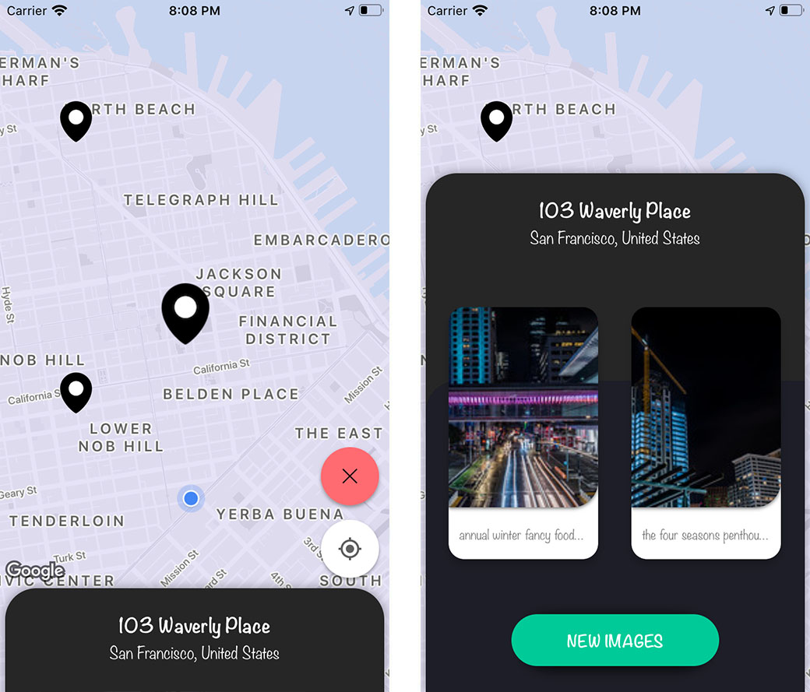
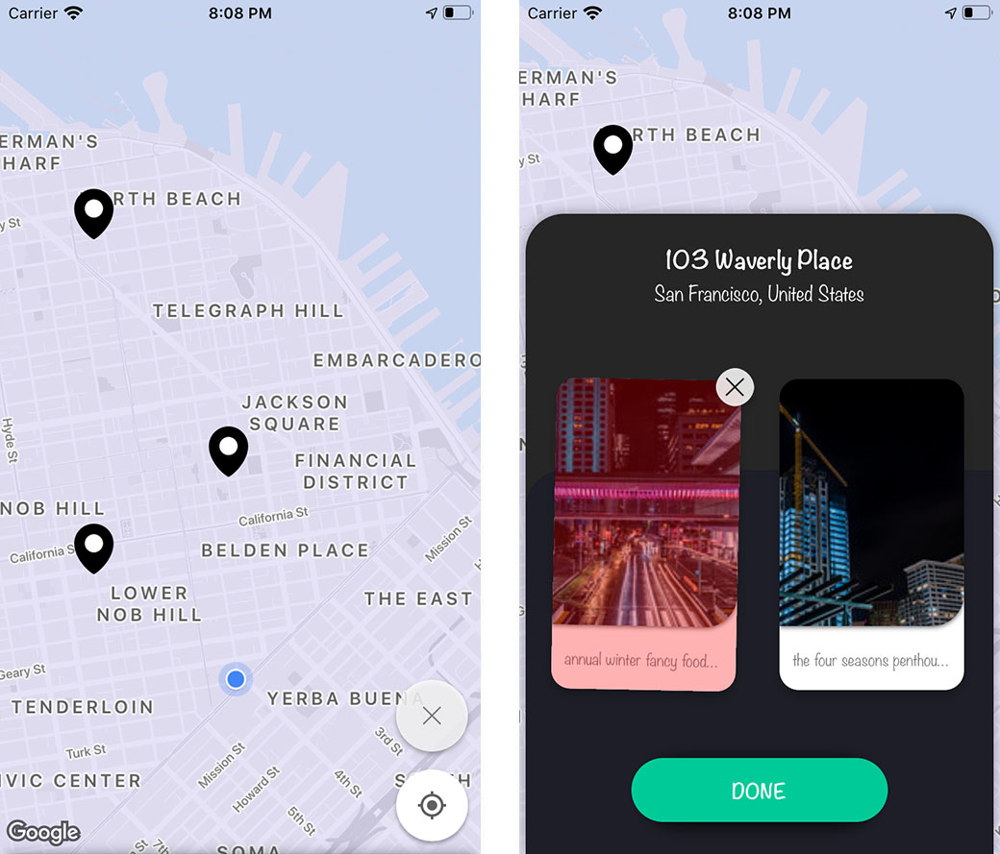

# Virtual Tourist

**Virtual Tourist** is an iOS app that lets users find attraction points by tapping on the map. The app then illustrates the address of the tapped location with nearby photos of interest. Users can view previously tapped locations and remove/update photos. 

## Overview
Photos are retrieved using the Flicker API, and is displayed on Google Maps. API keys for both Flickr and Google Maps are not available in the app. To be able to use the app, keys need to be inserted in placeholders in "GOOGLE\_MAPS\_API\_KEY\_PLACEHOLDER" and "FLICKR\_API\_KEY\_PLACEHOLDER". Note that in a production project, these keys need to be securely stored. Some of the best practises are:

* Not storing sensitive data in project source base. These can be injected suring CI/CD.
* Injecting encrypted data with encription keys.
* Obfuscating the encryption keys.

Once keys are inserted, run "bootstrap_workspace.sh" to build app dependencies, then compile and run in XCode.

Data persistency is implemented with Core Data.

Not all functionality is tested in the source base, but example unit tests are provided for the Map Interactor class. The provided Mocks are automatically generated with [Sourcery](https://github.com/krzysztofzablocki/Sourcery) using [Stencil](https://github.com/stencilproject/Stencil) templates.

## Illustration

